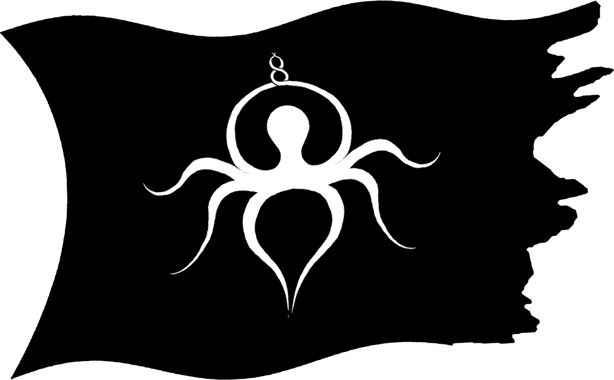

<!-- PROJECT LOGO -->
 

    

<h3 align="center">Verse</h3>

  

    A multi-platform multiplayer Virtual Reality experience developed with Unity
     
     
    <a href="https://o8c.us/verse">WebXR Deployment</a>
    ·
    <a href="https://o8c.us/verse/documentation/html/index.html">Documentation</a>
  

<!-- MARKDOWN LINKS & IMAGES -->
<!-- https://www.markdownguide.org/basic-syntax/#reference-style-links -->
[contributors-shield]: https://img.shields.io/github/contributors/octopus8/O8C.svg?style=for-the-badge
[contributors-url]: https://github.com/octopus8/O8C/graphs/contributors
[forks-shield]: https://img.shields.io/github/forks/octopus8/O8C.svg?style=for-the-badge
[forks-url]: https://github.com/octopus8/O8C/network/members
[stars-shield]: https://img.shields.io/github/stars/octopus8/O8C.svg?style=for-the-badge
[stars-url]: https://github.com/octopus8/O8C/stargazers
[issues-shield]: https://img.shields.io/github/issues/octopus8/O8C.svg?style=for-the-badge
[issues-url]: https://github.com/octopus8/O8C/issues
[license-shield]: https://img.shields.io/github/license/octopus8/O8C.svg?style=for-the-badge
[license-url]: https://github.com/octopus8/O8C/blob/master/LICENSE.txt
[linkedin-shield]: https://img.shields.io/badge/-LinkedIn-black.svg?style=for-the-badge&logo=linkedin&colorB=555
[linkedin-url]: https://linkedin.com/in/octopus8
[product-screenshot]: images/screenshot.png
